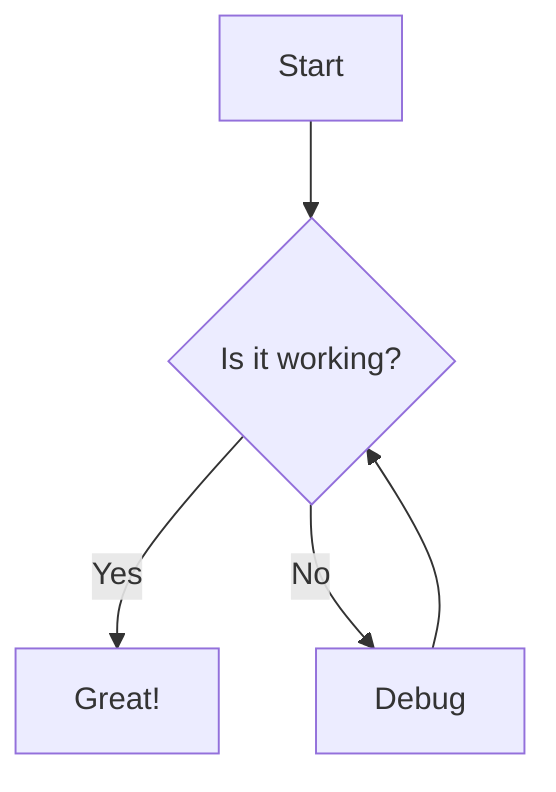
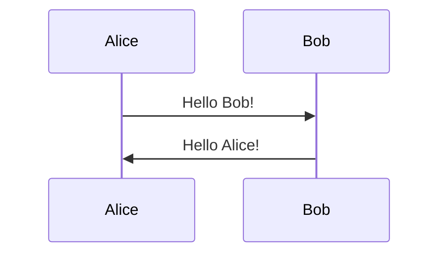

# MathJax and Mermaid Test

## MathJax Examples

Here's some inline math: $E = mc^2$ and $\alpha + \beta = \gamma$.

Display math:
$$\frac{d}{dx} \int_a^x f(t) dt = f(x)$$

Complex equation:
$$\sum_{n=1}^{\infty} \frac{1}{n^2} = \frac{\pi^2}{6}$$

## Mermaid Diagram

## Another Mermaid Diagram

