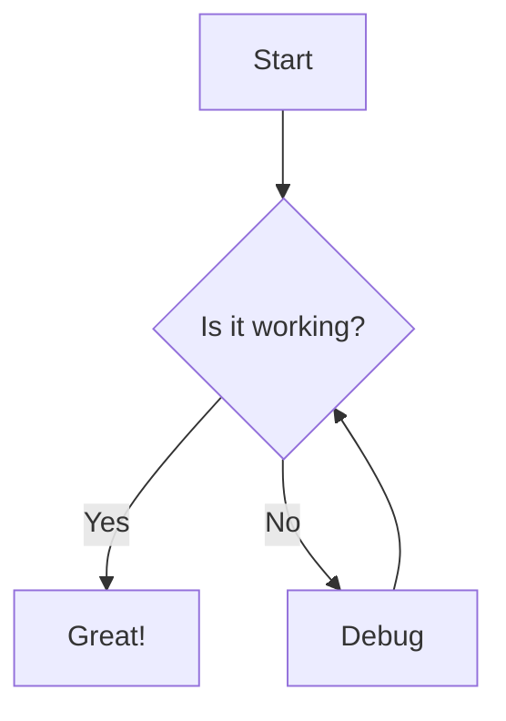

# Test Document

Basic **bold** and *italic* text.

## Headers

### Level 3
#### Level 4

## Lists

- Item 1
- Item 2
  - Nested item

1. First
2. Second

## Code

Inline `code` here.

```go
func main() {
    fmt.Println("Hello")
}
```

## Links & Images

[GitHub](https://github.com)


## Tables

| Header 1 | Header 2 |
|----------|----------|
| Cell 1   | Cell 2   |
| Cell 3   | Cell 4   |

## Quotes

> This is a blockquote
> with multiple lines

## Strikethrough

~~Crossed out text~~

## Task Lists

- [x] Completed task
- [ ] Incomplete task
- [x] Another done item

## Emoji Support

:rocket: :star: :tada:

## Footnotes

Here's a sentence with a footnote[^1].

[^1]: This is the footnote content.

## Definition Lists

Term 1
: Definition 1

Term 2
: Definition 2a
: Definition 2b

## Math Expressions

### Basic Math
Inline math: $E = mc^2$ and $a^2 + b^2 = c^2$

Greek letters: $\alpha, \beta, \gamma, \pi, \sigma, \omega$

### Intermediate Math
$$
\int_{-\infty}^{\infty} e^{-x^2} dx = \sqrt{\pi}
$$

$$
\sum_{n=1}^{\infty} \frac{1}{n^2} = \frac{\pi^2}{6}
$$

### Advanced Example (Maxwell's Equations)
$$
\nabla \cdot \mathbf{E} = \frac{\rho}{\epsilon_0}, \quad \nabla \times \mathbf{E} = -\frac{\partial \mathbf{B}}{\partial t}
$$

## Syntax Highlighting

```python
def fibonacci(n):
    """Generate Fibonacci sequence up to n."""
    a, b = 0, 1
    while a < n:
        yield a
        a, b = b, a + b

# Usage with type hints
from typing import Iterator

def fib_typed(n: int) -> Iterator[int]:
    return fibonacci(n)
```

## Mermaid Diagrams



## Advanced Tables

| Feature | Support | Notes |
|---------|:-------:|-------|
| Basic tables | ✅ | Standard GFM |
| Alignment | ✅ | Left, center, right |
| **Bold in cells** | ✅ | Full markdown |
| `Code in cells` | ✅ | Inline code |
| [Links](https://github.com) | ✅ | Clickable |

## GitHub Alerts

> [!NOTE]
> Useful information that users should know, even when skimming content.

> [!TIP]
> Helpful advice for doing things better or more easily.

> [!IMPORTANT]
> Key information users need to know to achieve their goal.

> [!WARNING]
> Urgent info that needs immediate user attention to avoid problems.

> [!CAUTION]
> Advises about risks or negative outcomes of certain actions.

## HTML in Markdown

<details>
<summary>Click to expand</summary>

This content is hidden by default and can be revealed by clicking the summary.

```javascript
console.log("JavaScript works inside details!");
```

</details>

## Keyboard Shortcuts

Press <kbd>Ctrl</kbd> + <kbd>C</kbd> to copy.

Use <kbd>⌘</kbd> + <kbd>Space</kbd> on Mac.

## Unicode and Special Characters

→ ← ↑ ↓ ✓ ✗ ★ ♥ ∞ α β γ δ

Copyright © 2025 • Trademark™ • Registered®

## Complex Lists

1. **First item** with multiple paragraphs

   This is the second paragraph of the first item.

   ```bash
   echo "Code in lists works too!"
   ```

2. **Second item** with nested content
   - Nested bullet
   - Another nested
     1. Even deeper nesting
     2. Multiple levels work

3. **Third item** with a table

   | Column A | Column B |
   |----------|----------|
   | Data 1   | Data 2   |


RECURSIVE WATCH TEST Wed Sep 17 03:42:02 PDT 2025
